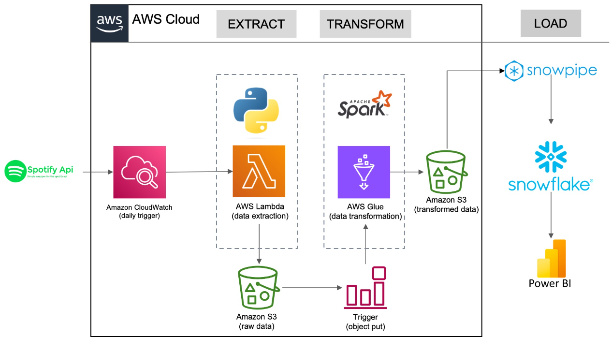

# 🎵 Spotify Data Pipeline using AWS & Snowflake

## Project Overview
This project involves implementing an ETL pipeline that integrates Spotify API, AWS, and Snowflake. The pipeline extracts music data (albums, artists, and tracks) from the Spotify API, processes it using AWS Glue (Spark), and stores the transformed data in Amazon S3. Finally, the data is ingested into Snowflake for structured analysis and reporting.

## Architecture

## Key Components
### Data Extraction
- **Spotify API:**  Retrieve music data, including track details, artist information, and albums.
- **AWS Lambda:** Fetches raw JSON data from the API and stores it in Amazon S3.
- **Amazon CloudWatch:** Automates and schedules the extraction process.

### Data Transformation
- **AWS Glue (Spark Jobs):**
    - 	Cleans and normalizes JSON data into structured tables.
    - 	Converts data into CSV format for efficient storage.
    - 	Handles schema evolution and large-scale data processing.

### Data Loading & Analytics
- **Amazon S3:** Stores both raw and transformed data.
- **Snowpipe (Snowflake):**
    - 	Automates ingestion of transformed data into Snowflake tables.
    -  Provides scalable and performant query execution.
- **Power BI:** Generates interactive dashboards for insights and trend analysis.
